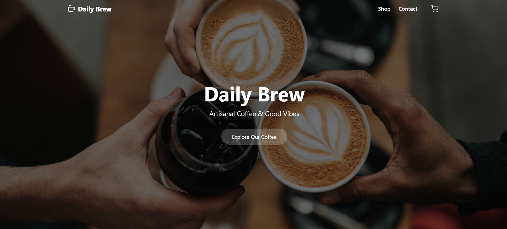
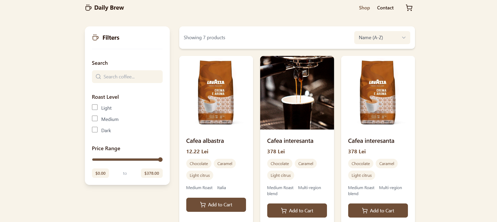
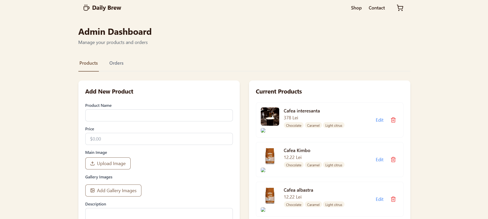
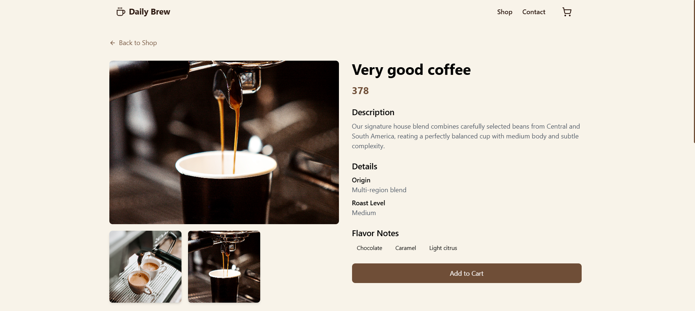
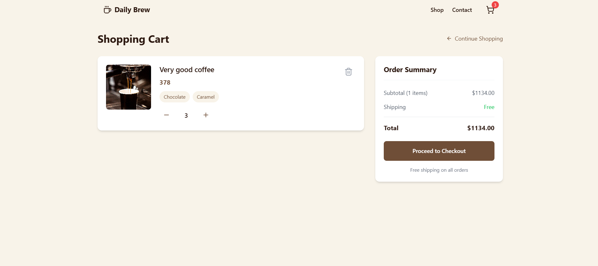
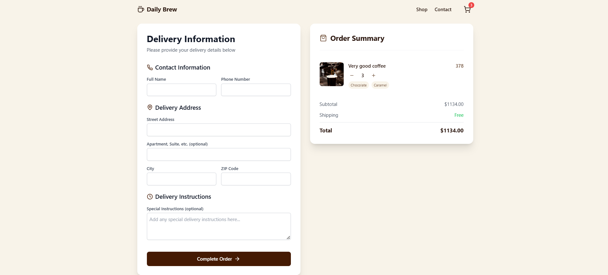
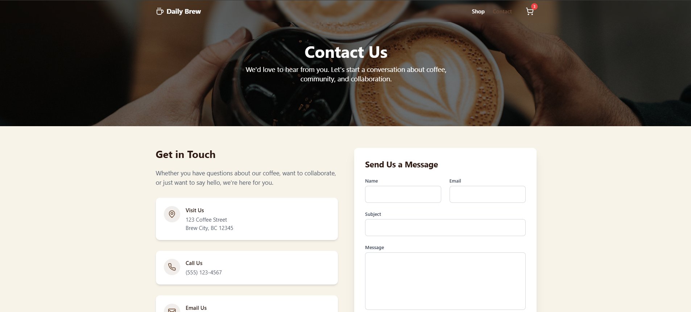
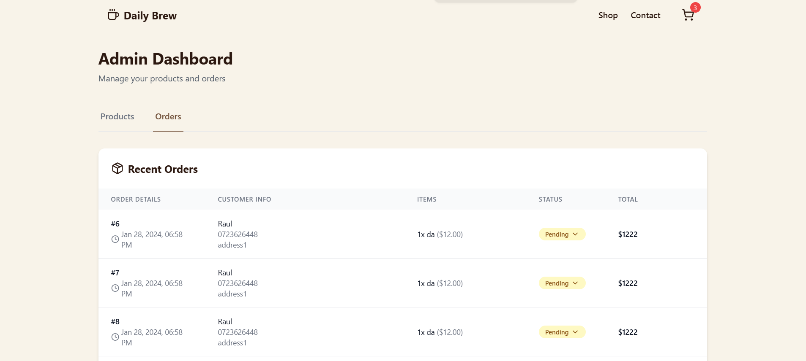

# Coffee Shop Backend Service

## What is this App
This application is a backend service for a coffee shop, built using Java and Spring Boot. It connects to a PostgreSQL database to manage coffee shop data and provides APIs for the frontend application. The application also handles file uploads and integrates with Azure Storage for storing images.

## Key Features:
- **Spring Boot**: Utilizes Spring Boot for rapid development and easy configuration.
- **PostgreSQL**: Connects to a PostgreSQL database for data persistence.
- **File Uploads**: Supports file uploads.
- **Azure Storage**: Integrates with Azure Storage for storing images.

## Configuration:
- **Database**: Configured to connect to a PostgreSQL database running locally.
- **File Storage**: Images are stored in the `static` directory within the project.
- **Azure Storage**: Uses Azure Storage for additional image storage.

## Frontend:
The frontend application for this backend service can be found [here](https://github.com/raulbaciulescu/coffee-shop-fe).

## Images:

